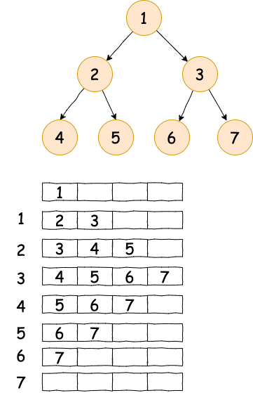

# 层级遍历

> 从上到下 从左到右 遍历

## 队列实现



- 初始化队列 根节点入队列
- 队头节点出队列
- 节点的左右孩子入队列
- 循环直至队列为空

```python
def stack_print(root):
    node = root
    queue = [node]
    result = []

    while queue:
        count = len(queue)
        line = []
        for i in range(count):
            node = queue.pop(0)
            line.append(node.val)

            if node.left:
                queue.append(node.left)
            if node.right:
                queue.append(node.right)

        result.append(line)

    return result
```
