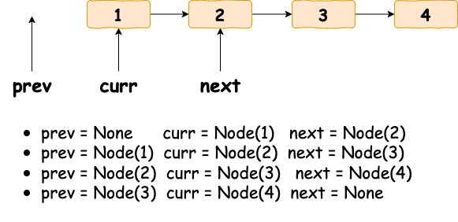

# 反转链表

## 迭代



```python
def reverse_list(head: ListNode) -> ListNode:
    prev = None
    curr = head

    while curr:
        nextnode = curr.next
        curr.next = prev

        prev = curr
        curr = nextnode

    return prev
```


## 递归

```python
def reverse_list(head: ListNode) -> ListNode:
    if not head or not head.next:
        return head

    newhead = reverse_list(head.next)
    head.next.next = head
    head.next = None

    return newhead
```
